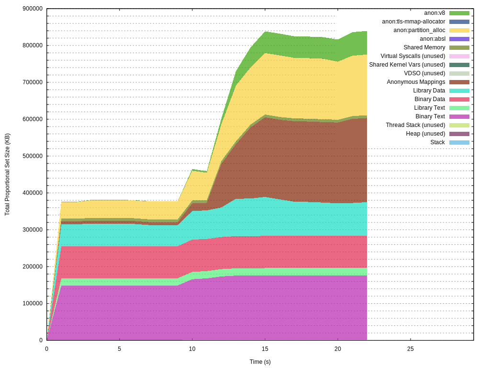

# smaps-profiler

This repository includes two programs: smaps-profiler and smaps-snapshot.

smaps-profiler reports stack, heap, text, data, and other categories of memory usage for a set of processes over time. It measures the Proportional Set Size (PSS) rather than the Resident Set Size (RSS) to avoid double-counting memory that is shared among processes. It sources data from the /proc/pid/smaps file for each process. It currently outputs TSV to the standard output (memory is in bytes), or it can output a graph to an SVG file (gnuplot must be installed on your system for this to work).

smaps-snapshot gets a more detailed report of the memory usage of a set of processes at one moment in time. It includes all of the same categories as smaps-profiler, but for memory that is backed by files, it can show the memory usage for each individual file. The output is a pretty-printed table (not strictly TSV).

# smaps-profiler 

## Examples

### TSV:
```console
$ smaps-profiler -c -f ^bash$
PID     STACK_PSS       HEAP_PSS        THREAD_STACK_PSS        BIN_TEXT_PSS    LIB_TEXT_PSS    BIN_DATA_PSS    LIB_DATA_PSS    ANON_MAP_PSS    VDSO_PSS        VVAR_PSS        VSYSCALL_PSS    SHM_PSS OTHER_PSS       CMD
9500    110592  1081344 0       328704  19456   110592  69632   69632   0       0       0       0       0       bash
24070   110592  1798144 0       324608  28672   186368  129024  69632   0       0       0       0       0       bash
105428  118784  4759552 0       3084288 156672  667648  2126848 122880  0       0       0       0       0       vim README.md
```

### Graph:
```console
$ smaps-profiler -c -f -g example-chromium.svg chromium
<output omitted>
^C
$ eog example-chromium.svg
```



## Usage
```
smaps-profiler [OPTIONS] [REGEX]

Arguments:
  [REGEX]  Regex to match process cmdline against

Options:
  -c, --match-children       If --regex is given, include children of matched processes, even if they don't match
  -s, --match-self           Match the process for this program
  -i, --interval <INTERVAL>  Refresh interval in seconds [default: 1]
  -f, --fail-on-noperm       Fail if permission is denied to read a process's info. Default behavior is to skip the process and continue running
  -g, --graph <GRAPH>        Save graph as SVG to <FILE>
  -w, --show-warnings        Print warnings to stderr
  -h, --help                 Print help
  -V, --version              Print version
```

# smaps-snapshot

## Example

```console
$ smaps-snapshot -c ^bash$
--------------------------------------------------------------------------------
Summary (4 processes)
Total: 17495040 bytes
--------------------------------------------------------------------------------
 52%  9076736  Heap                                                             
 18%  3100672  /usr/bin/vim.basic r-x-p                                         
  7%  1196032  /usr/lib/x86_64-linux-gnu/libpython3.12.so.1.0 rw--p             
  4%   735232  /usr/bin/bash r-x-p                                              
  4%   704512  /usr/lib/x86_64-linux-gnu/libpython3.12.so.1.0 r---p             
  3%   544768  <small categories>                                               
  3%   507904  /usr/bin/vim.basic r---p                                         
  3%   454656  Stack                                                            
  2%   331776  Anonymous Mappings                                               
  2%   283648  /usr/bin/bash r---p                                              
  1%   196608  /usr/bin/vim.basic rw--p                                         
  1%   139264  /usr/lib/x86_64-linux-gnu/libtinfo.so.6.4 r---p                  
  1%   112640  /usr/lib/locale/locale-archive r---p                             
  1%   110592  /usr/bin/bash rw--p                                              
Small categories (<0.5%):
  0%    73728  /usr/lib/x86_64-linux-gnu/libc.so.6 r---p                        
  0%    61440  /usr/lib/x86_64-linux-gnu/libsodium.so.23.3.0 r-x-p              
  0%    53248  /usr/lib/x86_64-linux-gnu/libsodium.so.23.3.0 r---p              
  0%    51200  /usr/lib/x86_64-linux-gnu/libc.so.6 r-x-p                        
  0%    51200  /usr/lib/x86_64-linux-gnu/libpython3.12.so.1.0 r-x-p             
  0%    38912  /usr/lib/x86_64-linux-gnu/libtinfo.so.6.4 r-x-p                  
  0%    32768  /usr/lib/x86_64-linux-gnu/ld-linux-x86-64.so.2 rw--p             
  0%    32768  /usr/lib/x86_64-linux-gnu/ld-linux-x86-64.so.2 r---p             
  0%    32768  /usr/lib/x86_64-linux-gnu/libc.so.6 rw--p                        
  0%    16384  /usr/lib/x86_64-linux-gnu/libtinfo.so.6.4 rw--p                  
  0%    12288  /usr/lib/x86_64-linux-gnu/libgpm.so.2 r-x-p                      
  0%    12288  /usr/lib/x86_64-linux-gnu/libgpm.so.2 r---p                      
  0%     8192  /usr/lib/x86_64-linux-gnu/libacl.so.1.1.2302 r---p               
  0%     8192  /usr/lib/x86_64-linux-gnu/libexpat.so.1.9.1 r---p                
  0%     4096  /usr/lib/x86_64-linux-gnu/ld-linux-x86-64.so.2 r-x-p             
  0%     4096  /usr/lib/x86_64-linux-gnu/libacl.so.1.1.2302 rw--p               
  0%     4096  /usr/lib/x86_64-linux-gnu/libexpat.so.1.9.1 rw--p                
  0%     4096  /usr/lib/x86_64-linux-gnu/libgpm.so.2 rw--p                      
  0%     4096  /usr/lib/x86_64-linux-gnu/libm.so.6 rw--p                        
  0%     4096  /usr/lib/x86_64-linux-gnu/libm.so.6 r---p                        
  0%     4096  /usr/lib/x86_64-linux-gnu/libpcre2-8.so.0.11.2 rw--p             
  0%     4096  /usr/lib/x86_64-linux-gnu/libpcre2-8.so.0.11.2 r---p             
  0%     4096  /usr/lib/x86_64-linux-gnu/libselinux.so.1 rw--p                  
  0%     4096  /usr/lib/x86_64-linux-gnu/libselinux.so.1 r---p                  
  0%     4096  /usr/lib/x86_64-linux-gnu/libsodium.so.23.3.0 rw--p              
  0%     4096  /usr/lib/x86_64-linux-gnu/libz.so.1.3 rw--p                      
  0%     4096  /usr/lib/x86_64-linux-gnu/libz.so.1.3 r---p                      
  0%     3072  /usr/lib/x86_64-linux-gnu/libexpat.so.1.9.1 r-x-p                
  0%     2048  /usr/lib/x86_64-linux-gnu/libm.so.6 r-x-p                        
  0%     1024  /usr/lib/x86_64-linux-gnu/libacl.so.1.1.2302 r-x-p               
  0%        0  Thread Stack                                                     
  0%        0  Vdso                                                             
  0%        0  Vvar                                                             
  0%        0  Vsyscall                                                         
  0%        0  Vsys                                                             
  0%        0  /usr/lib/x86_64-linux-gnu/gconv/gconv-modules.cache r--s-        
  0%        0  /usr/lib/x86_64-linux-gnu/libpcre2-8.so.0.11.2 r-x-p             
  0%        0  /usr/lib/x86_64-linux-gnu/libselinux.so.1 r-x-p                  
  0%        0  /usr/lib/x86_64-linux-gnu/libz.so.1.3 r-x-p                      
--------------------------------------------------------------------------------
PID 109185
vim README.md
Total: 11099136 bytes
--------------------------------------------------------------------------------
 43%  4775936  Heap                                                             
 28%  3100672  /usr/bin/vim.basic r-x-p                                         
 11%  1196032  /usr/lib/x86_64-linux-gnu/libpython3.12.so.1.0 rw--p             
  6%   704512  /usr/lib/x86_64-linux-gnu/libpython3.12.so.1.0 r---p             
  5%   507904  /usr/bin/vim.basic r---p                                         
  3%   314368  <small categories>                                               
  2%   196608  /usr/bin/vim.basic rw--p                                         
  1%   122880  Anonymous Mappings                                               
  1%   118784  Stack                                                            
  1%    61440  /usr/lib/x86_64-linux-gnu/libsodium.so.23.3.0 r-x-p              
Small categories (<0.5%):
  0%    53248  /usr/lib/x86_64-linux-gnu/libsodium.so.23.3.0 r---p              
  0%    51200  /usr/lib/x86_64-linux-gnu/libpython3.12.so.1.0 r-x-p             
  0%    40960  /usr/lib/x86_64-linux-gnu/libtinfo.so.6.4 r---p                  
  0%    18432  /usr/lib/x86_64-linux-gnu/libc.so.6 r---p                        
  0%    12288  /usr/lib/x86_64-linux-gnu/libgpm.so.2 r-x-p                      
  0%    12288  /usr/lib/x86_64-linux-gnu/libgpm.so.2 r---p                      
  0%    12288  /usr/lib/x86_64-linux-gnu/libtinfo.so.6.4 r-x-p                  
  0%     8192  /usr/lib/x86_64-linux-gnu/ld-linux-x86-64.so.2 rw--p             
  0%     8192  /usr/lib/x86_64-linux-gnu/ld-linux-x86-64.so.2 r---p             
  0%     8192  /usr/lib/x86_64-linux-gnu/libacl.so.1.1.2302 r---p               
  0%     8192  /usr/lib/x86_64-linux-gnu/libc.so.6 r-x-p                        
  0%     8192  /usr/lib/x86_64-linux-gnu/libc.so.6 rw--p                        
  0%     8192  /usr/lib/x86_64-linux-gnu/libexpat.so.1.9.1 r---p                
  0%     4096  /usr/lib/locale/locale-archive r---p                             
  0%     4096  /usr/lib/x86_64-linux-gnu/libacl.so.1.1.2302 rw--p               
  0%     4096  /usr/lib/x86_64-linux-gnu/libexpat.so.1.9.1 rw--p                
  0%     4096  /usr/lib/x86_64-linux-gnu/libgpm.so.2 rw--p                      
  0%     4096  /usr/lib/x86_64-linux-gnu/libm.so.6 rw--p                        
  0%     4096  /usr/lib/x86_64-linux-gnu/libm.so.6 r---p                        
  0%     4096  /usr/lib/x86_64-linux-gnu/libpcre2-8.so.0.11.2 rw--p             
  0%     4096  /usr/lib/x86_64-linux-gnu/libpcre2-8.so.0.11.2 r---p             
  0%     4096  /usr/lib/x86_64-linux-gnu/libselinux.so.1 rw--p                  
  0%     4096  /usr/lib/x86_64-linux-gnu/libselinux.so.1 r---p                  
  0%     4096  /usr/lib/x86_64-linux-gnu/libsodium.so.23.3.0 rw--p              
  0%     4096  /usr/lib/x86_64-linux-gnu/libtinfo.so.6.4 rw--p                  
  0%     4096  /usr/lib/x86_64-linux-gnu/libz.so.1.3 rw--p                      
  0%     4096  /usr/lib/x86_64-linux-gnu/libz.so.1.3 r---p                      
  0%     3072  /usr/lib/x86_64-linux-gnu/libexpat.so.1.9.1 r-x-p                
  0%     2048  /usr/lib/x86_64-linux-gnu/libm.so.6 r-x-p                        
  0%     1024  /usr/lib/x86_64-linux-gnu/ld-linux-x86-64.so.2 r-x-p             
  0%     1024  /usr/lib/x86_64-linux-gnu/libacl.so.1.1.2302 r-x-p               
  0%        0  Thread Stack                                                     
  0%        0  Vdso                                                             
  0%        0  Vvar                                                             
  0%        0  Vsyscall                                                         
  0%        0  Vsys                                                             
  0%        0  /usr/lib/x86_64-linux-gnu/libpcre2-8.so.0.11.2 r-x-p             
  0%        0  /usr/lib/x86_64-linux-gnu/libselinux.so.1 r-x-p                  
  0%        0  /usr/lib/x86_64-linux-gnu/libz.so.1.3 r-x-p                      
--------------------------------------------------------------------------------
PID 24070
bash
Total: 2504704 bytes
--------------------------------------------------------------------------------
 72%  1798144  Heap                                                             
 10%   243712  /usr/bin/bash r-x-p                                              
  4%   110592  Stack                                                            
  4%   107520  /usr/bin/bash r---p                                              
  3%    69632  Anonymous Mappings                                               
  2%    40960  <small categories>                                               
  2%    39936  /usr/lib/x86_64-linux-gnu/libtinfo.so.6.4 r---p                  
  1%    36864  /usr/bin/bash rw--p                                              
  1%    24576  /usr/lib/locale/locale-archive r---p                             
  1%    18432  /usr/lib/x86_64-linux-gnu/libc.so.6 r---p                        
  1%    14336  /usr/lib/x86_64-linux-gnu/libc.so.6 r-x-p                        
Small categories (<0.5%):
  0%    11264  /usr/lib/x86_64-linux-gnu/libtinfo.so.6.4 r-x-p                  
  0%     8192  /usr/lib/x86_64-linux-gnu/ld-linux-x86-64.so.2 rw--p             
  0%     8192  /usr/lib/x86_64-linux-gnu/ld-linux-x86-64.so.2 r---p             
  0%     8192  /usr/lib/x86_64-linux-gnu/libc.so.6 rw--p                        
  0%     4096  /usr/lib/x86_64-linux-gnu/libtinfo.so.6.4 rw--p                  
  0%     1024  /usr/lib/x86_64-linux-gnu/ld-linux-x86-64.so.2 r-x-p             
  0%        0  Thread Stack                                                     
  0%        0  Vdso                                                             
  0%        0  Vvar                                                             
  0%        0  Vsyscall                                                         
  0%        0  Vsys                                                             
  0%        0  /usr/lib/x86_64-linux-gnu/gconv/gconv-modules.cache r--s-        
--------------------------------------------------------------------------------
PID 109281
bash
Total: 2106368 bytes
--------------------------------------------------------------------------------
 66%  1384448  Heap                                                             
 12%   245760  /usr/bin/bash r-x-p                                              
  5%   114688  Stack                                                            
  5%   114688  /usr/bin/bash r---p                                              
  3%    69632  Anonymous Mappings                                               
  2%    40960  /usr/lib/x86_64-linux-gnu/libtinfo.so.6.4 r---p                  
  2%    36864  /usr/bin/bash rw--p                                              
  1%    29696  <small categories>                                               
  1%    24576  /usr/lib/locale/locale-archive r---p                             
  1%    18432  /usr/lib/x86_64-linux-gnu/libc.so.6 r---p                        
  1%    14336  /usr/lib/x86_64-linux-gnu/libc.so.6 r-x-p                        
  1%    12288  /usr/lib/x86_64-linux-gnu/libtinfo.so.6.4 r-x-p                  
Small categories (<0.5%):
  0%     8192  /usr/lib/x86_64-linux-gnu/ld-linux-x86-64.so.2 rw--p             
  0%     8192  /usr/lib/x86_64-linux-gnu/ld-linux-x86-64.so.2 r---p             
  0%     8192  /usr/lib/x86_64-linux-gnu/libc.so.6 rw--p                        
  0%     4096  /usr/lib/x86_64-linux-gnu/libtinfo.so.6.4 rw--p                  
  0%     1024  /usr/lib/x86_64-linux-gnu/ld-linux-x86-64.so.2 r-x-p             
  0%        0  Thread Stack                                                     
  0%        0  Vdso                                                             
  0%        0  Vvar                                                             
  0%        0  Vsyscall                                                         
  0%        0  Vsys                                                             
  0%        0  /usr/lib/x86_64-linux-gnu/gconv/gconv-modules.cache r--s-        
--------------------------------------------------------------------------------
PID 9500
bash
Total: 1784832 bytes
--------------------------------------------------------------------------------
 63%  1118208  Heap                                                             
 14%   245760  /usr/bin/bash r-x-p                                              
  6%   110592  Stack                                                            
  4%    69632  Anonymous Mappings                                               
  3%    61440  /usr/bin/bash r---p                                              
  3%    59392  /usr/lib/locale/locale-archive r---p                             
  2%    36864  /usr/bin/bash rw--p                                              
  2%    32768  <small categories>                                               
  1%    18432  /usr/lib/x86_64-linux-gnu/libc.so.6 r---p                        
  1%    17408  /usr/lib/x86_64-linux-gnu/libtinfo.so.6.4 r---p                  
  1%    14336  /usr/lib/x86_64-linux-gnu/libc.so.6 r-x-p                        
Small categories (<0.5%):
  0%     8192  /usr/lib/x86_64-linux-gnu/ld-linux-x86-64.so.2 rw--p             
  0%     8192  /usr/lib/x86_64-linux-gnu/ld-linux-x86-64.so.2 r---p             
  0%     8192  /usr/lib/x86_64-linux-gnu/libc.so.6 rw--p                        
  0%     4096  /usr/lib/x86_64-linux-gnu/libtinfo.so.6.4 rw--p                  
  0%     3072  /usr/lib/x86_64-linux-gnu/libtinfo.so.6.4 r-x-p                  
  0%     1024  /usr/lib/x86_64-linux-gnu/ld-linux-x86-64.so.2 r-x-p             
  0%        0  Thread Stack                                                     
  0%        0  Vdso                                                             
  0%        0  Vvar                                                             
  0%        0  Vsyscall                                                         
  0%        0  Vsys                                                             
  0%        0  /usr/lib/x86_64-linux-gnu/gconv/gconv-modules.cache r--s-
```

## Usage

```
smaps-snapshot [OPTIONS] [REGEX]

Arguments:
  [REGEX]  Regex to match process cmdline against

Options:
  -c, --match-children   If --regex is given, include children of matched processes, even if they don't match
  -s, --match-self       Match the process for this program
  -f, --fail-on-noperm   Fail if permission is denied to read a process's info. Default behavior is to skip the process and continue running
  -m, --mask <MASK>      A string of any combination of the characters "bfrwxsp" that specifies the mask to use when aggregating file-backed mappings. An empty string here (created by passing "-m=") will cause all of the mappings be aggregated into one entry. If the option is not present, the default behavior will be the same as passing "frwxsp"
  -o, --output <OUTPUT>  File to output info to (stdout if unspecified)
  -w, --show-warnings    Print warnings to stderr
  -v, --verbose          Print info messages
  -h, --help             Print help
  -V, --version          Print version
```
